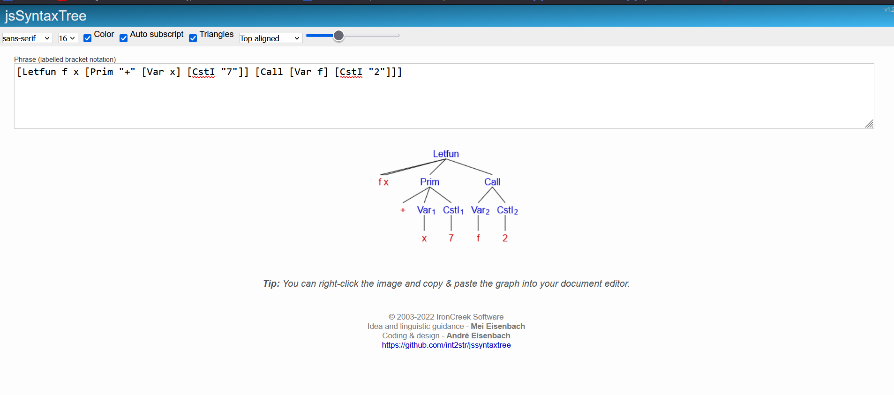

# MicroML AST Web App

This project is for **CS 510 Project 3** at Wichita State University. It is a simple F# web application built using ASP.NET Core and Giraffe. The app takes **MicroML** code as input and displays its **Abstract Syntax Tree (AST)** on the same page.

---

## ✨ Features

- Parse **MicroML** expressions using an F# lexer and parser (FsLexYacc).
- Display the **AST** in real time as a tree-like format in the browser.
- Clean and responsive design using **CSS**.
- Fully single-page experience – input and output are on the same page.
- All backend logic written in **F#** with `.NET 8` and Giraffe.
- AI tools were used only for assistance and debugging, not for blind copy-pasting.

---

## 📷 Screenshots



---

## 🛠️ Tech Stack

- **F#**
- **ASP.NET Core Web App**
- **Giraffe**
- **FsLexYacc** 
- **CSS**
- **HTML + JavaScript** 
- **.NET 8**

---

## 🚀 Getting Started

### Prerequisites

- [.NET 8 SDK](https://dotnet.microsoft.com/en-us/download/dotnet/8.0)
- Visual Studio or VS Code
- Git

### Run the App

```bash
git clone https://github.com/Jacob-Ranzau/project-3-web-app-Jacob-Ranzau.git
cd project-3-web-app-Jacob-Ranzau
dotnet restore
dotnet build
dotnet run
